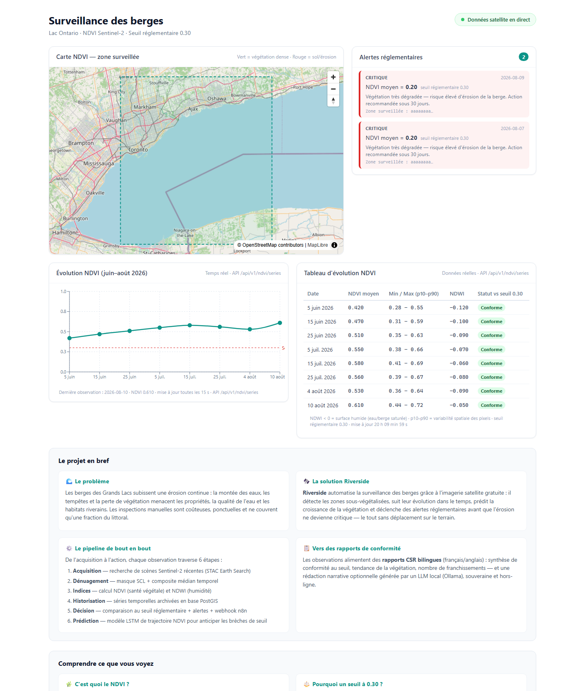
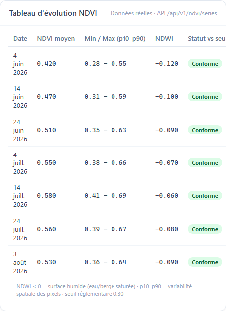
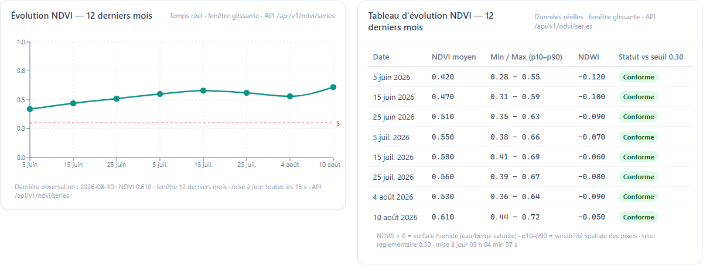
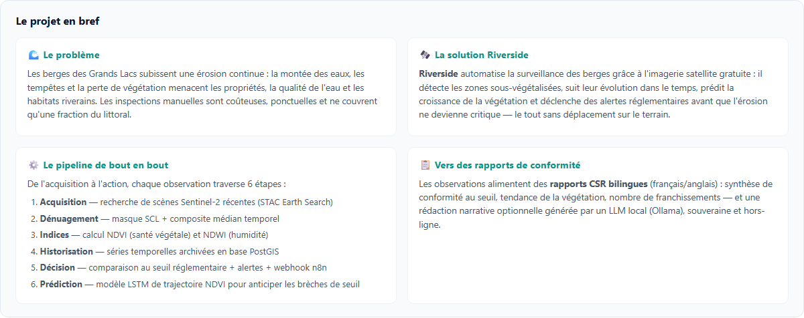
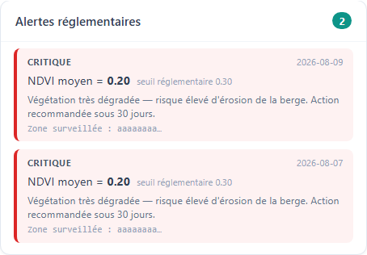
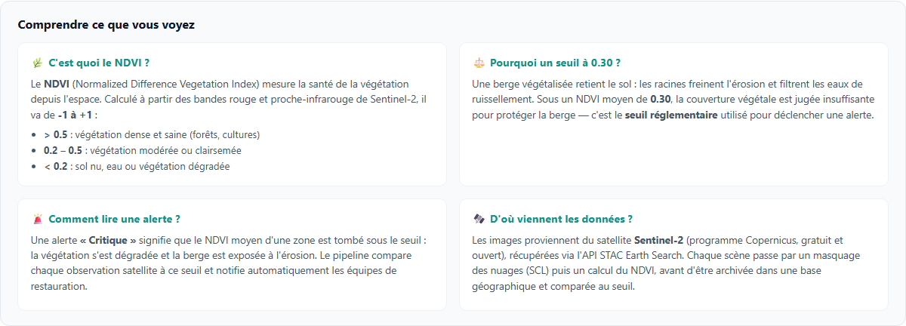
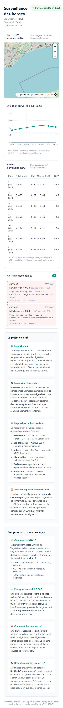

# Riverside

> Surveillance automatisée des berges — imagerie satellite + IA, 100 % open source.
> Automated shoreline monitoring — satellite imagery + AI, fully open source.


## Contexte / Context

Les inspections manuelles des berges du bassin des Grands Lacs sont coûteuses et peu fréquentes. Riverside automatise le suivi de la couverture végétale (NDVI) à partir d'images Sentinel-2 gratuites, détecte les zones sous-restaurées et érodables, prédit la croissance de la végétation et notifie tout dépassement de seuil réglementaire CSR.

## Architecture

```
Sentinel-2 L2A (Earth Search STAC, gratuit)
   │  src/ingest/stac_client.py  (pystac-client + stackstac)
   ▼
Cloud removal — src/cloud_removal/run_dsen2cr.py
   │  MVP : masque SCL + composite médian temporel
   │  Option : checkpoints pré-entraînés DSen2-CR
   ▼
Indices NDVI/NDWI — src/indices/ndvi.py
   ▼
Job d'ingestion — src/pipeline/ingest_job.py (série + alertes + n8n)
   ▼
Prédiction LSTM — src/predict/vegetation_lstm.py (CPU)
   ▼
API FastAPI v0.3 — src/api/main.py (RFC 7807)
   ▼
Frontend Next.js + MapLibre — web/ (SSR, SEO/AEO, a11y)
```

Docs : [Architecture](docs/ARCHITECTURE.md) · [V&V](docs/VV.md) · [Difficultés de session](docs/SESSION-DIFFICULTES.md) · OpenAPI : `/docs` sur l'API.

## GitHub Reference Audit (choix d'adoption)

| Repo | Rôle | Verdict |
|---|---|---|
| torchgeo/torchgeo (4,1k ⭐, MIT) | Segmentation berges, poids Sentinel-2 | Adopter (phase 4) |
| ameraner/dsen2-cr (180 ⭐) | Cloud removal SAR-optique, checkpoints fournis | Adopter en option |
| Penn000/SpA-GAN_for_cloud_removal | Baseline recherche | Inspiration seulement |
| pystac-client / stackstac / rioxarray | Ingestion + raster | Adoptés tels quels |

## Démarrage rapide / Quickstart

```bash
cp .env.example .env
docker compose up -d db n8n
pip install -r requirements.txt -r requirements-dev.txt
psql $DATABASE_URL -f db/migrations/001_init.sql
uvicorn src.api.main:app --reload   # API : http://localhost:8000/docs
cd web && npm install && npm run dev  # Frontend : http://localhost:3000
```

## Aperçu du dashboard

Le frontend présente un tableau de bord de surveillance des berges : carte NDVI,
série temporelle Sentinel-2, alertes réglementaires expliquées et un bloc
pédagogique « Comprendre ce que vous voyez ».

| Capture | Description |
|---|---|
|  | Vue complète (carte + série + tableau + alertes + projet + explainer) |
|  | Tableau d'évolution NDVI (données de l'API) |
|  | Graphique + tableau côte à côte (temps réel) |
|  | Le projet en bref (problème, solution, pipeline) |
|  | Panneau des alertes avec explication |
|  | Bloc pédagogique (NDVI, seuil, sources) |
|  | Vue mobile responsive |

## Déploiement Docker (local)

La stack complète (PostGIS + API + n8n) se déploie avec Docker Compose :

```bash
cp .env.example .env          # ajustez DATABASE_URL et les secrets
docker compose up -d --build  # db (PostGIS) + api (FastAPI) + n8n
docker compose ps             # vérifier le statut (healthy)
```

**Ports exposés** (config par défaut) : API `:8000`, PostGIS `:5432`, n8n `:5678`.

> `docker-compose.override.yml` mappe donc Riverside sur des ports dédiés :
> **API `:8001`**, PostGIS `:5433`, n8n `:5679**. Utilisez-le avec :
> `docker compose -f docker-compose.yml -f docker-compose.override.yml up -d`

Vérification :

```bash
curl http://localhost:8001/health        # → {"status":"ok","service":"riverside"}
curl http://localhost:8001/docs          # → OpenAPI Swagger UI
```

Initialisation de la base (premier démarrage) :

```bash
docker compose exec db psql -U riverside -d riverside -f /docker-entrypoint-initdb.d/001_init.sql
# ou, si la migration n'est pas montée :
docker compose exec -T db psql -U riverside -d riverside < db/migrations/001_init.sql
```

## Tests

```bash
pytest tests/ -v                     # 34 tests pytest, tout offline (par défaut)
ruff check src tests                 # lint — 0 erreur
cd web && npx tsc --noEmit           # TypeScript strict — 0 erreur
cd web && npx playwright test        # 3 tests E2E frontend (démarre Next.js :3101)
pytest tests/test_stac_live.py -m integration -v   # STAC réel (réseau, hors CI)
```

**Statut des tests (2026-08-07)** : 34/34 pytest passés, 3/3 Playwright passés,
0 échec — `ruff` 0 erreur, `tsc --noEmit` 0 erreur, CI verte sur `main`.
Détails dans [docs/VV.md](docs/VV.md).

## API (v0.3)

> **`aoi_id` est un UUID** (schéma Postgres) — la validation pydantic rejette
> les identifiants libres avec une erreur 422. L'alerte exige une AOI existante
> en base (FK `alerts_aoi_id_fkey`).

| Méthode | Endpoint | Rôle |
|---|---|---|
| GET | `/health` | Santé du service |
| GET | `/api/v1/scenes` | Recherche scènes Sentinel-2 (bbox, dates) |
| POST | `/api/v1/alerts/evaluate` | Évalue NDVI vs seuil → persiste + notifie si critique |
| GET | `/api/v1/alerts/open` | Alertes non acquittées |
| POST | `/api/v1/alerts/{id}/acknowledge` | Acquitte une alerte (404 sinon) |
| GET | `/api/v1/ndvi/series?aoi_id=&months=12` | Série temporelle NDVI d'une AOI — fenêtre glissante (défaut 12 mois) |
| GET | `/api/v1/reports/csr?aoi_id=` | Rapport CSR bilingue (contexte factuel + narrative Ollama optionnelle) |

## Sécurité & conformité

- Aucun secret codé en dur — variables d'environnement uniquement (.env, jamais commité).
- Données Copernicus libres de droits ; traitement local possible (Loi 25 friendly).
- API : CORS restreint, erreurs RFC 7807, logs JSON structurés (structlog).
- CI : ruff + pytest + tsc + Playwright à chaque push (GitHub Actions).

## Roadmap

- [x] Phase 1 — MVP : NDVI + alertes + tests
- [x] Phase 2 — CI, persistance SQLAlchemy, webhook n8n
- [x] Phase 3 — Acknowledge, job ingestion, frontend MapLibre, E2E + V&V
- [x] Phase 3.5 — V&V approfondie : durcissement tests (ingest_job, LSTM, STAC contractuel), lint + tsc à 0
- [x] Phase 3.6 — Actions post-V&V : push CI, requirements-dev, Playwright frontend, test STAC live
- [ ] Phase 4 — fine-tuning TorchGeo, DSen2-CR en production, acquittement via l'UI
- [ ] Phase 5 — Rapports CSR bilingues FR/EN via LLM local (Ollama), intégration EBP
